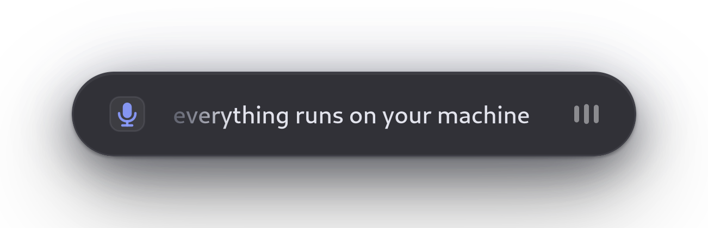
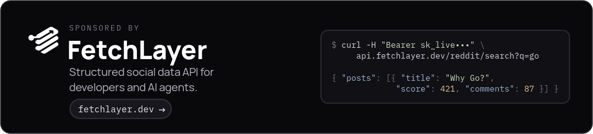
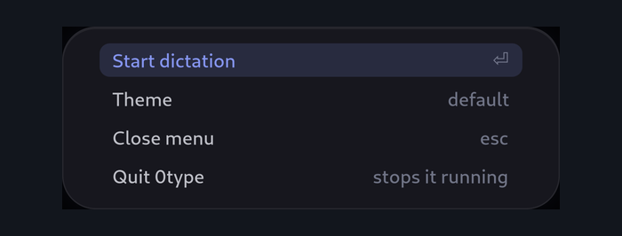
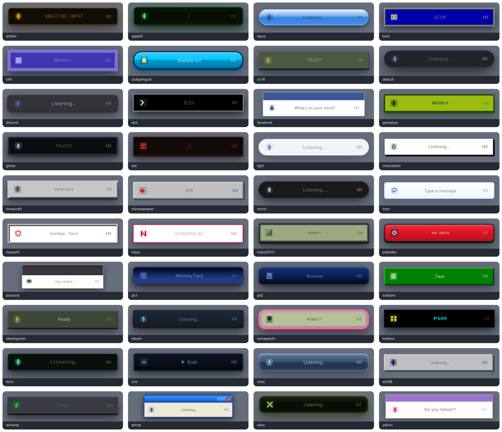

<div align="center">

# 0type

### Press a key. Talk. Press it again. Your words are on the clipboard.



Offline speech-to-text and voice typing for Linux, on Wayland and X11.<br>
Runs entirely on your own machine. No account, no subscription, nothing leaves your computer.

</div>

## Install

```sh
curl -fsSL https://raw.githubusercontent.com/IamAlexandros/0type/main/install.sh | sh
```

That's it. It installs 0type, downloads the speech model, starts it, and
offers to launch it when you log in. Then it tells you the one thing left
to do: pick a key to talk with.

<sub>Everything goes in `~/.local` — no sudo, nothing outside your home
folder. Uninstalling is deleting two directories.</sub>

<div align="center">

<a href="https://fetchlayer.dev"></a>

0type is sponsored by **[FetchLayer](https://fetchlayer.dev)** — structured social
data from every platform, through one API.

</div>

## Using it

**Press your key.** A small bar appears at the bottom of the screen.

**Talk.** The words show up as you say them, not after you stop.

**Press it again.** The bar disappears and everything you said is on your
clipboard, ready to paste.

That's the whole thing. It works in any app — your editor, a browser, a
chat box — because it's just the clipboard.

Run `0type` on its own for a menu:

<div align="center">

</div>

## Forty themes

<div align="center">

</div>

Open the menu, pick **Theme**, and arrow through them — each one applies
instantly as you move, so you can see them all in about ten seconds.
Enter keeps it, Esc puts back the one you started with.

They're more than colours. The Game Boy says `READY` and `SAVED!`, DOS
answers with `1 file(s) copied.`, the Commodore 64 boots to `READY.`, and
the Tamagotchi has a little creature living in it. The fonts are real
too — genuine pixel type, a fourteen-segment calculator display, actual
handwriting on the Polaroid.

### Making your own

A theme is a single CSS file. Copy one you like from `themes/` into
`~/.config/0type/themes/`, change the colours, and select it in the menu.
Yours appears in the list next to the built-in ones.

```css
#zt-panel  { background-color: #1a1a21; border-radius: 26px; }
#zt-label  { color: #ecedf5; font-size: 15px; }
#zt-accent { color: #7a8cff; }

/* 0type-idle: whenever you're ready
 * 0type-copied: got it
 */
```

Preview it while you work, without touching your microphone:

```sh
0type ui --theme ./mine.css --text "hello there"
```

## Settings

Optional, in `~/.config/0type/config.toml`:

```toml
theme = "term"

[hooks]
on_copy = "wtype -"                      # type it out instead of copying
on_stop = "notify-send 0type 'copied'"   # ping me when it's done
```

**Hooks** are just shell commands. They get your text on stdin, run in the
background, and can never break or slow down dictation. Handy ones: type
straight into the focused window, append to a notes file, pipe it
somewhere else.

## Handy commands

| | |
| --- | --- |
| `0type` | the menu |
| `0type toggle` | start/stop talking — **this is the one to bind to a key** |
| `0type themes` | list every theme |
| `0type config` | show your settings and where they came from |
| `0type listen` | transcribe to the terminal, no window |

## Set up your shortcut

0type is driven by one command, `0type toggle`. Bind it to a key and you're
done. Pick anything that's free — **Ctrl + Alt + Space** works well.

**GNOME** — paste this into a terminal:

```sh
S=org.gnome.settings-daemon.plugins.media-keys
P=/org/gnome/settings-daemon/plugins/media-keys/custom-keybindings/0type/
L=$(gsettings get $S custom-keybindings)
case "$L" in *"$P"*) ;; "@as []"|"[]") gsettings set $S custom-keybindings "['$P']" ;;
  *) gsettings set $S custom-keybindings "${L%]}, '$P']" ;; esac
gsettings set $S.custom-keybinding:$P name '0type'
gsettings set $S.custom-keybinding:$P command "$HOME/.local/bin/0type toggle"
gsettings set $S.custom-keybinding:$P binding '<Control><Alt>space'
```

It adds to your existing shortcuts rather than replacing them, and it's safe
to run again. Change `<Control><Alt>space` if you'd like a different key.

<details>
<summary><b>GNOME, the clicking way</b></summary>

1. Open **Settings → Keyboard → View and Customize Shortcuts**
2. Scroll to **Custom Shortcuts** and click **Add Shortcut**
3. Name: `0type`
4. Command: the **full path**, e.g. `/home/you/.local/bin/0type toggle`<br>
   <sub>GNOME doesn't expand `~` here. Run `echo ~/.local/bin/0type` to get yours.</sub>
5. Click **Set Shortcut** and press your keys

</details>

<details>
<summary><b>KDE Plasma</b></summary>

1. Open **System Settings → Keyboard → Shortcuts**
2. Click **Add New → Command or Script…**
3. Command: `~/.local/bin/0type toggle`
4. Set your key combination and **Apply**

<sub>On Plasma 5 it's **System Settings → Shortcuts → Custom Shortcuts → Edit →
New → Global Shortcut → Command/URL**.</sub>

</details>

<details>
<summary><b>Hyprland</b></summary>

Add to `~/.config/hypr/hyprland.conf`:

```ini
bind = CTRL ALT, SPACE, exec, ~/.local/bin/0type toggle
```

</details>

<details>
<summary><b>Sway / i3</b></summary>

Add to `~/.config/sway/config` or `~/.config/i3/config`, then reload:

```
bindsym Ctrl+Mod1+space exec ~/.local/bin/0type toggle
```

</details>

<details>
<summary><b>XFCE</b></summary>

1. Open **Settings → Keyboard → Application Shortcuts**
2. Click **Add**, enter `~/.local/bin/0type toggle`
3. Press your key combination

</details>

<details>
<summary><b>Cinnamon</b></summary>

1. Open **System Settings → Keyboard → Shortcuts**
2. Click **Add custom shortcut**
3. Name `0type`, command `~/.local/bin/0type toggle`
4. Click the new entry's **Keyboard bindings** field and press your keys

</details>

## Questions

**Does it work offline?** Yes, always. The model lives on your disk and
nothing is ever sent anywhere.

**What does it need?** A Linux desktop with GTK4 and ALSA — that's almost
any of them. Works on Wayland and X11, GNOME and KDE.

**How big is it?** The program is about 10MB. The speech model is 650MB
and downloads once.

**Is it fast?** Words appear about a second behind you, on CPU. No GPU
needed.

**Something's wrong.** Run `0type config` to see what it thinks your
settings are. If your key stops working, `0type toggle` from a terminal
will restart it and tell you what happened.

## Similar projects

0type isn't the only way to dictate on Linux. If it's not the right fit, these
are worth a look:

- **[Handy](https://github.com/cjpais/Handy)**: free, open source speech-to-text
  for Windows, macOS and Linux
- **[nerd-dictation](https://github.com/ideasman42/nerd-dictation)**: simple,
  hackable offline speech-to-text using VOSK
- **[voxtype](https://github.com/peteonrails/voxtype)**: push-to-talk
  voice-to-text for Wayland compositors, using Whisper
- **[hyprwhspr](https://github.com/goodroot/hyprwhspr)**: speech-to-text for
  Linux on Wayland and X11, tuned for Nvidia GPUs
- **[vocalinux](https://github.com/VocaHQ/vocalinux)**: offline voice dictation
  with Whisper and VOSK, GPU-accelerated

0type's own take: words appear live while you're still talking, transcription
runs on NVIDIA's Parakeet model on your CPU, and it comes with forty themes.

## For the curious

It's a single Go binary using NVIDIA's Parakeet speech model through ONNX
Runtime, drawing its window with GTK4 and Cairo. If you want the whole
story — how the streaming works, why the overlay is built the way it is,
and everything that broke on the way — that's in
[`docs/SETUP.md`](docs/SETUP.md).

Building it yourself takes two commands:

```sh
sudo dnf install golang gtk4-devel alsa-lib-devel libX11-devel \
                 fontconfig-devel onnxruntime-devel     # or your distro's equivalent
make build
```

## A note from me

This project is heavily vibe-coded.

I built 0type for myself. I wanted voice typing on Linux that didn't suck,
was fast, private, and actually nice to look at, and nothing I tried felt
right, so I made my own. I use it every day.

I've been a full-stack developer for 8+ years, and right now most of my time
goes into [FetchLayer](https://fetchlayer.dev) and
[AskAds](https://askads.ai). So instead of hand-crafting every line, I built
this one fast and leaned on AI to do a lot of the heavy lifting. It works
really well for me, but expect a few rough edges.

If something breaks or you've got an idea, open an issue or a PR. I'll get to
it when I can.

— [Alexandros](https://github.com/IamAlexandros)

## License

MIT. The bundled fonts are SIL Open Font License 1.1 — see
[`LICENSE`](LICENSE).
